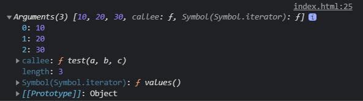
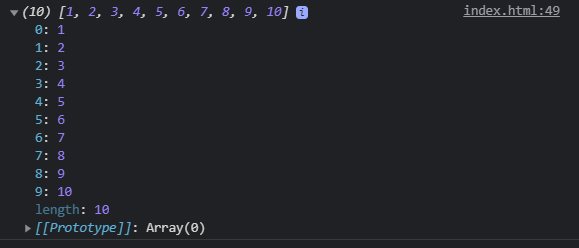

# ES6의 Function 기능 정리
## 함수의 default
함수를 만들 때 파라미터에 default 값을 줄 수 있다 
<br />

```javascript
function sum (num1, num2 = 5) {
  console.log(a + b)
}

sum(3)
```

> 두 개의 파라미터를 가진 함수를 하나의 파라미터로 호출 시 호출된 함수의 default값이 있다면 해당 파라미터에  정해진 default 값을 사용 할 수 있다.

위 코드의 결과로 8이 출력이 된다
<br />

### default 값으로 **수학 연산자** 도 사용이 가능하다.
<br />

```javascript
function sum(a, b = 5 * a) {
  console.log(a + b)
}

sum(3)
```

다른 파라미터와 연산도 가능하다.
<br />
결과로 18이 출력이 된다.
<br />

### default 값으로 **함수** 까지 사용이 가능하다.

```javascript
function one() {
  return 1
}

function sum(a, b = one()) {
  console.log(a + b)
}

sum(3)
```

> sum() 함수의 두번째 파라미터의 기본 값이 one() 함수를 할당하고있고 one() 함수를 실행하면 1이 나오기 때문에 기본 값은 1이 된다. <br />
> 결과로 4가 출력이 된다.

## 함수의 arguments
함수의 모든 파라미터 모두를 다루고 싶을 때 `arguments` 라는 키워드를 사용하면 된다. 
<br />

```javascript
function func(num1, num2, num3) {
  console.log(arguments)
}

func(10, 20, 30)
```

<br />

<br />

결과로 콘솔창에 입력된 파라미터를 담는 array와 비슷한 자료가 출력이 되는 것을 볼 수 있다.
<br />
즉, 모든 입력된 파라미터들을 [] 안으로 넣어주는 키워드라 생각하면 된다.
<br />

```javascript
function func(num1, num2, num3) {
  console.log(arguments[0])
  console.log(arguments[1])
  console.log(arguments[2])
}

func(10, 20, 30)
```

arguments 키워드를 이용해서 모든 파라미터를 하나씩 출력해주는 코드이다.
<br />

```javascript
function func(num1, num2, num3) {
  for (let i = 0; i < arguments.length; i++) {
  console.log(arguments[i])
  }
}

func(10, 20, 30)
```

이런식으로 반목문을 사용할 수도 있다.
<br />

## Rest 파라미터
arguments 키워드랑 비슷하지만 **ES6부터** `Rest 파라미터`라는 것이 추가가 되어 더 쉽게 사용이 가능해 졌다.
<br />
함수를 만들 때 `...` 라는 기호를 파라미터에 사용하면 된다.
<br />

```javascript
function func2(...rest) {
  console.log(rest)
}

func2(1, 2, 3, 4, 5, 6, 7, 8, 9, 10)
```

<br />

<br />
결과를 보면 모든 파라미터를 [] array안에 담아 출력이 되는 것을 볼 수 있다.
<br />
> Rest 파라미터는 원하는 파라미터 왼쪽에 ... 기호를 붙여주면 이 자리에 오는 모든 파라미터를 중괄호로 감싸준 파라미터 라고 생각하면 된다.
<br /><br />
Rest 파라미터를 다른 자리에 사용할 수도 있다.
<br />

```javascript
function func2(num1, num2, ...rest) {
  console.log(rest)
}

func2(1, 2, 3, 4, 5)
```

위 코드는 결과가 [3, 4, 5] 가 출력이된다
<br />
첫번째와 두번째 파라미터는 num1, num2 로 할당이 되어있기 때문에 그 뒤에 나오는 모든 파라미터가 나오게 된다.
<br />

### Rest 파라미터 사용 주의사항
Rest 파라미터는 항상 나머지 부분에 사용을 해야되는데, 쉽게 말해서 Rest는 항상 마지막 파라미터로 넣어야된다.
<br />

```javascript
function func2(num1, ...rest, num2) {
  console.log(rest) // 에러발생
}
```

또 2개 이상 사용하면 에러가 발생하게 된다.
<br />

```javascript
function func2(...rest, ...rest2) {
  console.log(rest) // 에러발생
}
```

