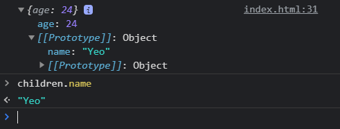

# Prototype (프로토타입)
> 프로토타입은 보통 객체의 원형이라고 말한다.
<br />
함수는 객체며 생성자로 사용될 함수도 객체다.
<br />
객체는 프로퍼티를 가질 수 있는데 이때 프로토타입이라는 프로퍼티가 있다.
<br />
프로토타입에 저장된 속성들은 생성자를 통해서 객체가 만들어질 때 그 객체에 연결된다.
<br />

생성자 함수를 만들면 프로토타입이라는 항목이 생성자 함수 안에 생성이 된다.
<br />

```javascript
function People() {
  this.name = 'Yeo'
  this.age = 24
}

let a = new People()

console.log(People.prototype)
```

출력 결과를 보면 프로토타입이라는 공간이 출력이 되는데 객체의 원형, 쉽게 말해서 부모의 유전자역할을 해주는 공간이라 보면된다.
<br />

> 즉, 프로토타입은 자식들이 물려받을 수 있는 유전자라고 생각하면 된다. <br />

People.prototype 에 변수나 함수가 있다면 생성자함수로 생성되는 인스턴스는 전부 그대로 물려받아 사용할 수 있다.
<br />

```javascript
function People() {
  this.name = 'Yeo'
  this.age = 24
}

People.prototype.gender = 'man'
let a = new People()

console.log(a.gender)
```

prototype 에 { gender: 'man' } 이라는 key/value 한쌍을 저장한 코드이다.
<br />
콘솔창에 man이 출력이 되는것을 확인 할 수 있다.
<br />

> 프로토타입은 값을 여러개 부여할 수 있고, 함수도 넣을 수 있다. <br />
> 프로토타입은 다른 자료형엔 없고, constructor `함수에만 생성이 된다.`

<br/>

## (참고) prototype과 constructor의 차이점
constructor: 자식들이 값을 직접 소유하게 만들 때
<br />
prototype: 부모만 가지고 있고 그걸 참조해서 쓰게 만들 때

## \__proto__
생성자함수로 생성된 상속받은 자식 object들은 \__proto__ 라는 속성을 가지고 있다
<br />
출력을 해보면 부모의 prototype이 출력이 된다
<br />
즉, \__proto__는 부모의 prototype과 같은 의미

```javascript
function People() {
  this.name = 'Yeo'
  this.age = 24
}

var a = new People()
console.log(a.__proto__)
console.log(People.prototype)
```

출력을 해보면 결과가 똑같이 나오는 것을 알 수 있다.
<br /> 

\_\_proto__를 활용해서 `object`끼리 상속기능을 구현할 수 있다.
<br /> 

```javascript
var parent = {
  name: 'Yeo'
 
var children = {
  age: 24
}

children.__proto__ = parent
console.log(children)
```

object를 만들어서 \_\_proto__ 를 강제로 설정해 상속을 구현한 내용이다.
<br />


<br />

children는 { name: 'Yeo' } 라는 오브젝트를 상속받을 수 있다.
<br />
이렇게 되면 children.name 속성을 자유롭게 사용이 가능하게 된다.
<br />
