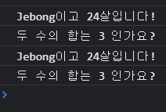

# Spread Operator (스프레드 연산자)
간단하게 설명하면 배열과 객체같은 Reference Type의 괄호제거 해주는 연산자 이다.
<br />

```javascript
var array = ['one', 'two']
console.log(array)
console.log(...array)
```

- 콘솔창에 결과를 보면 첫번째는 ["one", "two"] 으로 출력이되고,
- 두번째는 one two 으로 출력이 되는 것을 볼 수 있다.
<br />

배열뿐만 아니라 문자열에도 사용이 가능하다.

```javascript
var str = 'hello'
console.log(str)
console.log(...str)
```

- 첫번째 결과로 Hello 가 출력이 되지만,
- 두번째 결과는 H e l l o 로 출력이 된다.

spread를 문자열에 사용하면 문자를 하나씩 펼쳐준다고 생각하면 된다.
<br />

## Spread Operator 활용하기
### 서로다른 참조 타입 (Reference Type) 합치기
예시로 서로다른 배열 두개를 합치고 싶다면?

```javascript
var num1 = [1, 2, 3]
var num2 = [4, 5]
var res = [...num1, ...num2]

console.log(res)
```

위 코드를 실행해 보면 [1, 2, 3, 4, 5] 로 출력되어 있어 2개의 배열이 합쳐져 있는 것을 확인할 수 있다.
<br />

### 참조 타입 (Reference Type) 복사하기
- 먼저 복사란, 원본과 모두 같은 내용으로 복사본을 만드는 작업
- 원본과 사본이 따로 존재하게, 즉 원본과 사본은 내용은 같지만 서로 다르게 존재한다
<br />
복사에는 크게 2가지의 종류로 나누어 지는데

#### 1. 깊은 복사 (deep copy)
- 원본의 내용 그대로 복사본을 만들어 복사하는 방법
- `primitive type` 에서 발생하는 복사이다.

#### 2. 얕은 복사 (shallow copy)
- 사본이 없으며 원본을 참조만 하도록 하여 복사한 척을 하는 복사
- `Reference Type` 에서 발생하는 복사라고 생각하면 된다.

```javascript
var a = [1, 2, 3]
var b = a
b[3] = 4

console.log(a)
console.log(b)
```
배열 a를 선언 후 배열 b에 a를 할당하면 복사가 될 수 있다고 생각하는 사람들이 많다. 
<br />
배열 b에 4를 추가해서 a와 b의 결과를 확인해보면 
<br />

```
(4)[1, 2, 3, 4]
(4)[1, 2, 3, 4]
```

> 건들지도 않은 배열a 까지 4가 할당 되어있는 것을 볼 수 있는데,
배열이나 객체같은 `Reference Type` 에는 따로 하나의 값을 가지게 되는 것이 아닌 `값 공유`가 되기 때문에 b에 할당된 4가 a에도 적용이 되는 것을 볼 수 있다.

이러한 문제를 쉽게 해결하기위해 spread를 이용하면 된다
<br />

```javascript
var a = [1, 2, 3]
var b = [...a]
b[3] = 4

console.log(a)
console.log(b)
```

spread를 사용하게되면 `Reference Type`에서도 deep copy가 가능하다.
<br />

### (참고) 원시타입(primitive type)과 참조타입(reference type)
자바스크립트의 자료형은 크게 두가지의 형태가 있다
<br />

#### 원시타입(primitive type)
- String, Number, Boolean, Null, Undefined, Symbol와 같은 타입
- 원시타입은 메모리에 값을 그대로 저장함
- 참조 없이 값이 변동되었을때 메모리에 값을 그대로 저장함

#### 참조타입(reference type)
- 객체, 배열, 함수 등과 같은 Object형식의 타입
- 메모리에 값을 주소로 저장하고, 출력시 메모리주소와 일치하는 값을 출력한다.
- 메모리의 주소를 참초한다고 생각하면 된다.
<br />

### Array를 함수의 파라미터로 사용하기
함수를 Call 할 때 spread문법을 이용해 배열 형태에서 바로 함수 인자로 넣어줄 수 있다.
<br />

```javascript
function sum(num1, num2, num3) {
  console.log(num1 + num2 + num3)
}

var array = [1, 2, 3]
sum(...array)
```

배열의 있는 모든 숫자항목들이 sum() 함수의 파라미터로 넣기 위해 spread 연산자를 사용한 코드이다. 
<br />
출력했을 때 1, 2, 3을 더해준 결과 6이 출력이 되는 것을 볼 수 있다.
<br />

#### apply 함수와 call 함수
spread 연산자가 없던 시절에는 `apply()` 함수를 사용해 기능을 구현했다. 
<br />

```javascript
function sum(num1, num2, num3) {
  console.log(num1 + num2 + num3)
}

var array = [1, 2, 3]
sum.apply(undefuned, array)
```
해석하자면 sum() 함수를 실행하는데 undefined에 적용해서 실행하고, 파라미터로 array를 사용하겠다는 뜻이다
<br />

다른 예제로 array() 함수를 써보았다.
<br />

```javascript
var data = {
  func: function() {
    console.log(`${ this.name }이고 ${ this.age }살입니다!`)
  }
}

var data2 = {
  name: 'Jebong',
  age: 24
}
```

위에 코드있는 data의 func()라는 함수를 data2에서 사용을 할려면 apply() 함수를 사용한다
<br />
apply() 함수는 쉽게 생각해 이 함수를 실행하는데 저 오브젝트에다가 적용해서 실행하겠다는 뜻이다.
<br />

```javascript
var data = {
  func: function() {
    console.log(`${ this.name }이고 ${ this.age }살입니다!`)
  }
}

var data2 = {
  name: 'Jebong',
  age: 24
}

data.func.array(data2)
```

array() 함수를 실행하여 data.func() 함수를 실행하는데 data2라는 객체에 있는 함수처럼 실행하게 만든 코드이다.
<br />
`call()` 함수도 array() 와 마찬가지로 다른 객체 대신 메소드를 호출하는데 사용이되며, 사용법과 결과가 똑같다.
<br />
> array()와 call()의 차이점 <br />
> call 메소드는 인자 하나 하나를, apply는 인자 리스트를 전달


```javascript
    var data = {
      func: function (num1, num2) {
        console.log(`${ this.name }이고 ${ this.age }살입니다!`)
        console.log(`두 수의 합는 ${ num1 + num2 } 인가요?`)
      }
    }

    var data2 = {
      name: 'Jebong',
      age: 24
    }

    data.func.apply(data2, [1, 2])
    data.func.call(data2, 1, 2)
```

코드를 보면 apply와 call은 파라미터를 넘기는 방법을 제외하고 똑같은 실행결과를 출력하는 것을 알 수 있다. <br />
