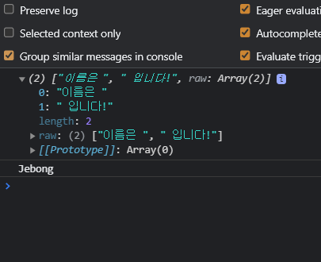

# Template literals (템플릿 리터럴)
자바스크립트에서 문자를 다룰 때 어려웠던 점을 해결하기 위해 새로 도입된 문자열 표기법 이다.
<br />
문자열 사용시 따옴표 대신에, 백틱(`)을 사용한다.
<br /><br />

# 템플릿 리터럴의 기능
## 줄바꿈
문자 중간중간에 엔터키 입력이 가능해진다 
<br />

```javascript
var str = `
Hello
  World!`
```
<br /><br />

## 표현식 삽입
기존에는 , + 연산자를 이용해야 했는데 템플릿 리터럴 방식은 ${} 으로 간단하게 사용이 가능하다.

기존 방식
```javascript
var name = 'Jebong'
var str = '이름은'+ name +'입니다!'
```

템플릿 리터럴 사용
```javascript
var name = 'Jebong'
var str = `이름은 ${ name } 입니다!`
```

${} 의 결과는 문자열이 자동으로 반환된다.
<br /><br />

## Tagged Templates
함수를 이용해서 문자를 해체분석기능을 만들어줄 수도 있다.
<br /> 
문자 중간중간에 있는 단어 순서를 바꾸거나 변수를 제거하는 등 특정 상황에 유용하다.
<br />

```javascript
var name = 'Jebong'

function func() {
  return 1
}

func`이름은 ${ name } 입니다!`
```

함수를 실행시킬 때 소괄호 대신에 문자를 이용해서 함수를 실행시킬 수 있다.
<br /> 
(함수가 실행해 콘솔창에 1이 출력이 된다)
<br />
실행할 함수이름을 쓰고 소괄호 대신 백틱 문자를 붙여주면 된다.
<br /><br />

함수를 이용해 문자와 변수를 해체분석을 할 수도 있다.
<br />

```javascript
var name = 'Jebong'

function func(str, data) {
  console.log(str)
  console.log(data)
}

func`이름은 ${ name } 입니다!`
```

- 함수에 파라미터 두개를 추가해준다
- 첫번째 파라미터는 `` 내부에서 문자만 골라 배열로 만들어 놓은 값
- 두번째 파라미터는 `` 내부에서 ${ } 변수를 담는 파라미터 (변수 개수의 따라 파라미터를 추가하면 된다.)
<br />


<br />

> ["이름은", "입니다!"] 와 Jebong 이 출력이 되는 것을 볼 수 있다

이것을 응용하면 문자열의 순서도 손쉽게 바꿀 수 있다.
<br />

```javascript
var name = 'Jebong'

function func(str, data) {
  console.log(str[1] + data + str[0])
}

func`이름은 ${ name } 입니다!`
```

> 결과로  입니다!Jebong이름은  라고 출력이 되는 것을 볼 수 있다.