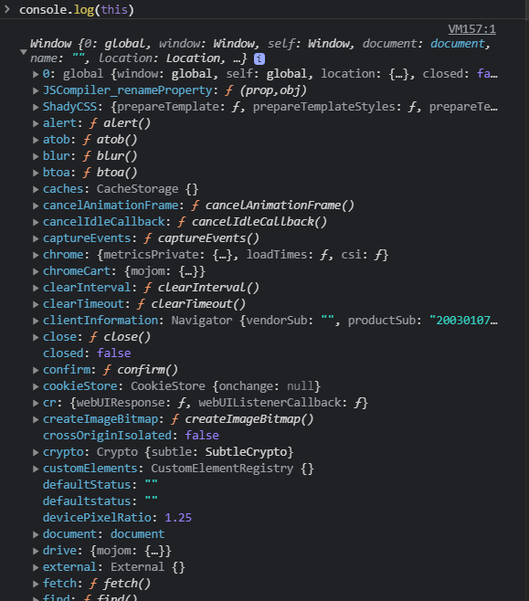
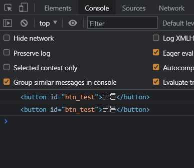
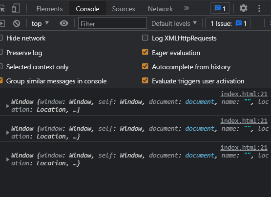
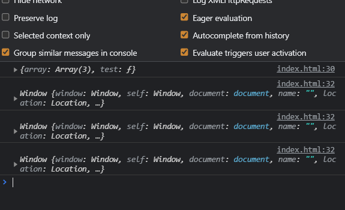
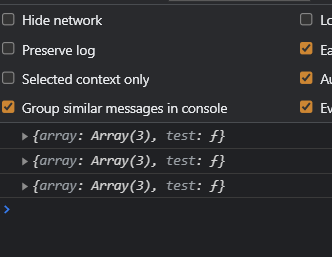

# this 키워드
## this?
자바스크립트에서의 this 키워드는 경우에 따라서 가리키는 대상이 다르다. <br />
사용하는 환경에 따라서 4개 이상의 각각 다른 뜻을 가지고 있다.
<br />

## this 키워드의 역할
1. 일반 함수 호출 시에는 전역 객체 즉, **window 객체**를 가리킨다
1. **메소드 호출** 시에는 메소드를 호출한 객체를 가리킨다
1. **constructor** 안에서 사용하면 constructor 새로생성되는 오브젝트를 가르킨다
1. 이벤트리스너 안에서 사용하면 **e.currentTarget**과 의미가 같다
<br />

### 일반 함수 호출 시에는 전역 객체 즉, window 객체를 가리킨다
HTML 파일을 만들어서 \<script>태그를 열어 this 키워드를 콘솔에 출력해 본다 <br />

```javascript
console.log(this)
```

다음과 같이 **window 객체**를 확인할 수 있다
<br />

<br />

비슷하게 일반 함수 내에서 this라는 값을 불러본다.

```javascript
function test() {
  console.log(this)
}
test()
```

똑같이 this라는 값은 window 라고 출력이 되는걸 확인할 수 있다.
<br />

#### window?
window는 모든 전역변수, 함수, DOM을 보관하고 관리하는 전역객체라고 생각하면 된다.
<br />

#### (참고) strict mode 키워드
- **strict mode**를 사용하면 함수 안에서의 this는 **unmdefined**가 된다.
- **strict mode**라는 키워드를 페이지 최상단에 추가하면 **strict mode**로 자바스크립트를 작성할 수 있다.
- **strict mode**에서는 변수선언 없이 사용하거나, 이상한 키워드로 선언하는 실수를 방지해준다.

```javascript
'use strict'
a = 100

function test() {
  console.log(this)
}
test()
```

- use strict 키워드를 최상단에 작성해주면
- a라는 값은 변수 선언을 안해주었기 때문에 오류가나며,
- test함수에있는 this는 undefined라는 값을 출력하는걸 알 수 있다.
<br />

### 메소드 호출 시에는 메소드를 호출한 객체를 가리킨다
이번에는 object를 만들어 object의 메소드 안에서 this키워드를 호출해 본다.
> 오브젝트에 들어가는 함수들을 메소드(method) 라고 한다.
<br />

```javascript
let object = {
  name: 'Changyu',
  age: 24,
  test: function() {
    console.log(this)
  }
}

object.test()
```

- 콘솔창에 { name: Changyu, age: 24 }같은 객체가 출력이 되는걸 볼 수가 있다.
- 즉, 메소드안에서 this를 쓰면 this는 메소드를 가지고 있는 오브젝트를 뜻한다.
<br />

### constructor 안에서 사용하면 constructor 새로생성되는 오브젝트를 가르킨다
#### constructor(생성자) 란?
자바스크립트에서 오브젝트를 비슷한걸 여러개 만들고 싶을 경우 **constructor** 라는걸 만들어서 사용한다 <br />
쉽게 말해서 **constructor**는 오브젝트를 복사해서 생성해주는 특별한 메소드라고 생각하면 된다
<br />

constructor 사용법
```javascript
function constructor() {
  this.name = 'Changyu'
}

let object = new constructor()
```
- 여기서의 this는 constructor로부터 새로 생성될 오브젝트들을 의미한다.
- new 키워드를 이용하면 새로운 오브젝트를 꺼낼 수 있다.
- 새로운 오브젝트는 { name: 'Changyu' } 라는 값을 가지고 있음
<br />

### 이벤트리스너 안에서 사용하면 e.currentTarget과 의미가 같다

해당버튼이 클릭되면 이벤트가 발생하는 코드를 짜본다.

```HTML
<body>
  <button id="btn_test">버튼</button>
  
  <script>
    document.getElementById('btn_test').addEventListener('click', function(e) {
      console.log(this)
      console.log(e.currentTarget)
    }
  </script>
</body>
```

- 여기서의 this는 **e.currentTarget**와 똑같은 의미로,
- **e.currentTarget**은 지금 이벤트가 동작하는 곳을 뜻한다


<br />

#### 이벤트리스너 안에서의 콜백함수에서 this
이벤트리스너 안에서 forEach() 반목문을 사용했다고 가정해보면
<br />

```HTML
<body>
  <button id="btn_test">버튼</button>
  
  <script>
    document.getElementById('btn_test').addEventListener('click', function(e) {
      let array = [1, 2, 3]
      array.forEach(function(a) {
        console.log(this)
      })
    })
  </script>
</body>
```

콘솔창의 결과는 window가 출력이 되는걸 볼 수가 있다
<br /><br />

<br />
저런 콜백함수는 일반함수랑 똑같은 취급을 하기 때문에 window가 출력이 된다.
<br />

#### 오브젝트 안에서의 콜백함수에서 this
이번엔 오브젝트 안에서에 코드를 가정해보면

```javascript
  let object = {
    array: [1, 2, 3],
    test: function() {
      console.log(this) // 이 부분은 메소드를 호출한 객체를 가리키고 있다
      object.array.forEach(function() {
        console.log(this) // 이 부분은 일반 함수에서 호출했기 때문에 window 객체를 가리키고 있다
      })
    }
  }

  object.test()
```

forEach()안에 콜백함수도 **일반 함수**이기 때문에 window 객체가 출력이 되는걸 볼 수가 있다.
<br /><br />

<br />

#### Arrow Function인 경우
- 자바스크립트 ES6 문법 중, () => {} 이라는 화살표함수 문법이 있다.
- 이걸 쓰면 함수 내부의 this 값을 새로 바꿔주지 않기 때문에 this를 사용할 때 유용하다.

```javascript
  let object = {
    array: [1, 2, 3],
    test: function() {
      object.array.forEach(() => {
        console.log(this)
      })
    }
  }

  object.test()
```

결과 화면
<br /><br />
