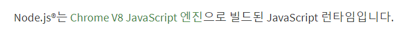

# NodeJS에 대한 간단한 정리
NodeJS란? 
<br />
 
<br />
Chrome V8 Javascript 엔진으로 빌드된 Javascript 런타임이다.
<br />

<h2>HTML</h2>
HTML은 웹페이지를 만들 때 사용하는 언어

```HTML
<div id="container">Hello World!</div>
```
<br />

<h2>JavaScript</h2>
그리고 HTML과 함께 사용하던 언어가 JavaScript 이다 
<br />
JavaScript는 웹페이지를 움직이게 만들 때 사용하는데

```javascript
document.getElementById('container').innerHTML = 'Hello javascript!';
```

보통 이런식으로 사용되며 HTML을 조작해서 내용을 바꾸거나 클릭하면 움직이게 만드는게 가능하다
<br />

<h2>V8 자바스크립트 엔진</h2>
자바스크립트 해석엔진인 V8이라는 프로그램은 크롬브라우저의 자바스크립트 해석엔진이다. 
<br />
성능이 너무 뛰어난 나머지 V8엔진을 따로 출시하게 되는데 이것이 Node.js이다 
<br />

<h2>NodeJS</h2>
간단하게 말해 자바스크립트를 브라우저 말고도 로컬 PC에서도 실행시켜줄 수 있는 런타임 이다
<br />

# Node.js의 특징
Non-blocking I/O 라는 장점 때문에 많이들 사용한다 
<br />
(요청이 많거나 오래걸리는 요청이 있어도 멈추가나 요청 대기시간이 없음) 
<br />

단점도 있는데 처리속도가 떨어질 수 있으며, 수학연산이나 이미지처리 같은 라이브러리는 부족하다