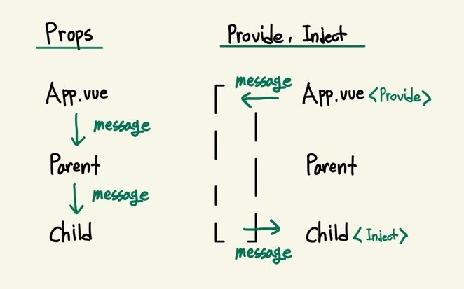

# Provide / Inject
밑에 코드는 props를 이용해서 App 컴포넌트에 있는 데이터를 Child 컴포넌트까지 전달 해주는 과정이다.
<br />

App.vue
```vue
<template>
  <Parent :msg="message" />  
</template>

<script>
import Parent from './components/Parent'

export default {
  components: {
    Parent
  },
  data() {
    return {
      message: '안녕하세요!'
    }
  }
}
</script>
```
<br />

Parent.vue
```vue
<template>
  <Child :msg="msg" />
</template>

<script>
import Child from './Child'

export default {
  components: {
    Child
  },
  props: {
    msg: {
      type: String,
      default: ''
    }
  }
}
</script>
```
<br />

Child.vue
```vue
<template>
  <div>
    Child: {{ msg }}
  </div>
</template>

<script>
export default {
  props: {
    msg: {
      type: String,
      default: ''
    }
  }
}
</script>
```

App 컴포넌트의 데이터 message를 Child 컴포넌트에 출력하기 위해 Parent를 거쳐 Child까지 props를 해준 상태인데, <br />
Parent는 message를 Child로 전달해 주기뿐 데이터를 전혀 사용하지 않는 구조이다.
<br /><br />
이러한 문제를 해결하기 위해 `Provide`와 `Inject`을 사용할 수 있는데, <br />
그러면 Parent 컴포넌트를 중간 매개체로 사용하지 않아도 되는 좀 더 간결한 구조로 만들 수 있다.

App.vue
```
provide() {
  return {
    msg: this.message
  }
}
```

App 컴포넌트의 script 부분에 `provide`를 data의 구조처럼 사용해 추가로 선언할 수 있다.
<br />

Child.vue
```vue
<template>
  <div>
    Child: {{ msg }}
  </div>
</template>

<script>
export default {
  inject: [
    'msg'
  ]
}
</script>
```

Chile 컴포넌트에서는 기존 props의 내용을 지우고 대신 `inject`를 배열 데이터로 추가하여 provide에 명시했던 'msg'를 가져오면 된다.
<br />

<br /><br />

## 사용시 주의할 점
provide 와 inject는 `반응성을 제공하지 않는다.`
<br />
App 컴포넌트에 똑같은 message를 출력하게 만들고 message를 변경하는 버튼을 만들어 두 데이터의 반응성을 확인해보면

App.vue
```vue
<template>
  <button @click="message = '변경해줘요!'">
    message 변경하기
  </button>
  <h1>App: {{ message }}</h1>
  <Parent />
</template>
```


결과를 보면 provide로 데이터를 넘겨서 출력하고 있는 child 컴포넌트에 msg는 내용이 갱신되지 않음을 확인할 수 있다.
<br />

## provide에 반응성 주기
먼저 App 컴포넌트 script 부분에 객체 구조 할당을 이용해서

```vue
import { computed } from 'vue'
```

`computed`를 vue로부터 import 해주고

```vue
provide() {
  return {
    msg: computed(() => {
      return this.message
    })
  }
}
```

가져온 computed함수를 실행해 콜백함수로 this.message를 return 해준다.

```
Child: { "_dirty": true, "__v_isRef": true, "__v_isReadonly": true }
```
결과 화면을 보면 child는 computed 함수에서 계산된 객체 데이터를 출력해 주는 것을 볼 수 있는데, <br />
의도한 대로 데이터를 출력 해주기 위해

Child.vue
```vue
<template>
  <div>
    Child: {{ msg.value }}
  </div>
</template>
```

Child 컴포넌트에서 msg를 출력했던 부분에 `value`를 추가하면 정상적인 출력을 할 수 있다. <br />
이제 버튼을 누르면 App과 Child에 있던 message들이 정상적으로 변경하게 된다.

### 총정리 코드
App.vue
```vue
<template>
  <button @click="message = '변경해줘요!'">
    message 변경하기
  </button>
  <h1>App: {{ message }}</h1>
  <Parent />
</template>

<script>
import Parent from './components/Parent'
import { computed } from 'vue'

export default {
  components: {
    Parent
  },
  data() {
    return {
      message: '안녕하세요!'
    }
  },
  provide() {
    return {
      msg: computed(() => this.message) // return과 중괄호 생략
    }
  }
}
</script>
```
<br />

Parent.vue
```vue
<template>
  <Child />
</template>

<script>
import Child from './Child'

export default {
  components: {
    Child
  }
}
</script>
```
<br />

Child.vue
```vue
<template>
  <div>
    Child: {{ msg.value }}
  </div>
</template>

<script>
export default {
  inject: [
    'msg'
  ]
}
</script>
```