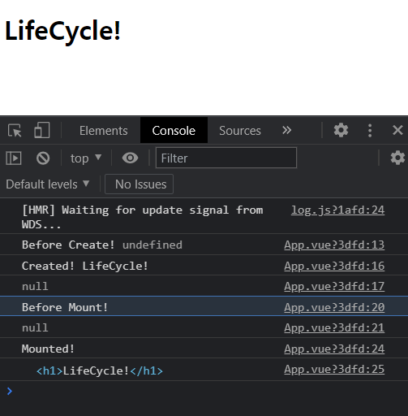

# 라이프사이클 훅
- 각각의 컴포넌트는 생성될 때 일련의 초기화 단계 과정을 거치게 된다
- 그 과정에서 ``라이프사이클 훅`` 이라는 함수를 통해 특정 단계에서 자신의 코드를 추가해서 실행할 수 있다
<br />

## 라이프사이클 다이어그램
 <br />
<a href="https://v3.ko.vuejs.org/guide/instance.html#%E1%84%85%E1%85%A1%E1%84%8B%E1%85%B5%E1%84%91%E1%85%B3%E1%84%89%E1%85%A1%E1%84%8B%E1%85%B5%E1%84%8F%E1%85%B3%E1%86%AF-%E1%84%83%E1%85%A1%E1%84%8B%E1%85%B5%E1%84%8B%E1%85%A5%E1%84%80%E1%85%B3%E1%84%85%E1%85%A2%E1%86%B7">[참고문서]</a>

1. Vue.createApp 이라는 메소드를 이용해 프로젝트를 시작하고, mount라는 메소드로 HTML 구조에 연결한다
1. 기본적인 Vuejs의 여러가지 이벤트와 라이프사이클이 초기화가 된다
    - 이과정이 끝난 **직후** ``beforeCreate`` 라는 라이프사이클 훅이 실행된다
1. 기본적인 injections와 reactivity가 초기화가 된다(데이터들, 기본적은 반응성이 만들어지는 과정...)
    - 초기화가 끝난 **직후** ``created`` 라는 라이프사이클 훅이 실행된다
    - 하나의 vuejs 컴포넌트가 생성되기 직전(beforeCreate)과 직후(created)를 구분한다고 생각하면 쉽다
1. Vuejs에 템플릿이라는 옵션을 사용여부에 따라 기본적인 처리과정을 거친다
1. 실제 HTML 구조부분에 연결한다 (app.$el)
    - 연결되기 **직전**에 ``beforeMount`` 라는 라이프사이클 훅이 실행된다
    - 연결이 된 **직후** 에는 ``Mounted`` 라는 라이프사이클 훅이 실행된다
    - HTML 구조에 연결이되기 직전(beforeMount)과 직후(Mounted)를 구분해서 이해하면 쉽다
1. 실제로 연결이되어져있는 상태에서 **데이터가 업데이트**되자마자
    - ``beforeUpdate`` 라는 라이프사이클 훅이 실행된다
1. 그 직후에 Virtual DOM 이라는 가상의 돔을 통해 수정내용을 비교분석후 새로 랜더링을 한다
    - 리랜더링이 된 후에는 ``updated``라는 라이프사이클 훅이 실행된다
1. unmount() 메소드를 실행하게 되면 Vuejs에서 작성한 컴포넌트의 연결이 끊어지게 된다 
    - 컴포넌트의 연결이 완벽하게 **끊어지기 전에** ``beforeUnmount``라는 라이프사이클 훅이 실행하게되고
    - 실제로 연결이 **끊어지게되면** ``unmounted`` 라이프사이클 훅이 실행하게 된다

> ``created``은 컴포넌트가 연결이 된상태로 가장 빠르게 만날수 있는 라이프사이클 훅이고, <br />
> ``mounted``은 실제로 화면에 랜더링이 된 직후에 바로 확인할 수 있는 라이프사이클이기 때문에 <br />
> 이 두개의 라이프사이클이 가장많이 사용되고있고, 제일 중요하다
<br />

## 라이프사이클 사용예시
라이프사이클을 간단하게 사용해본다
<br />

```javascript
<template>
  <h1>{{ data }}</h1>
</template>

<script>
export default {
  data() {
    return {
      data: 'LifeCycle!'
    }
  },
  beforeCreate() {
    console.log('Before Create!', this.data)
  },
  created() {
    console.log('Created!', this.data)
    console.log(document.querySelector('h1'))
  },
  beforeMount() {
    console.log('Before Mount!')
    console.log(document.querySelector('h1'))
  },
  mounted() {
    console.log('Mounted!')
    console.log(document.querySelector('h1'))
  }
}
</script>

<style>

</style>
```
<br />

이코드의 결과는 다음과 같다 
<br />


설명 추가해줘ㅓㅓ엉